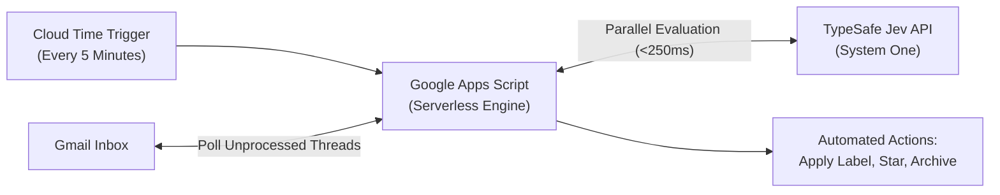
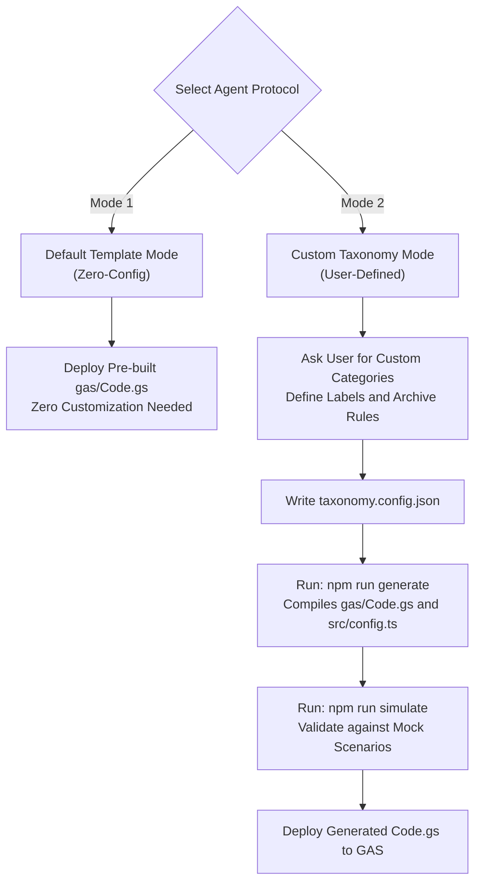
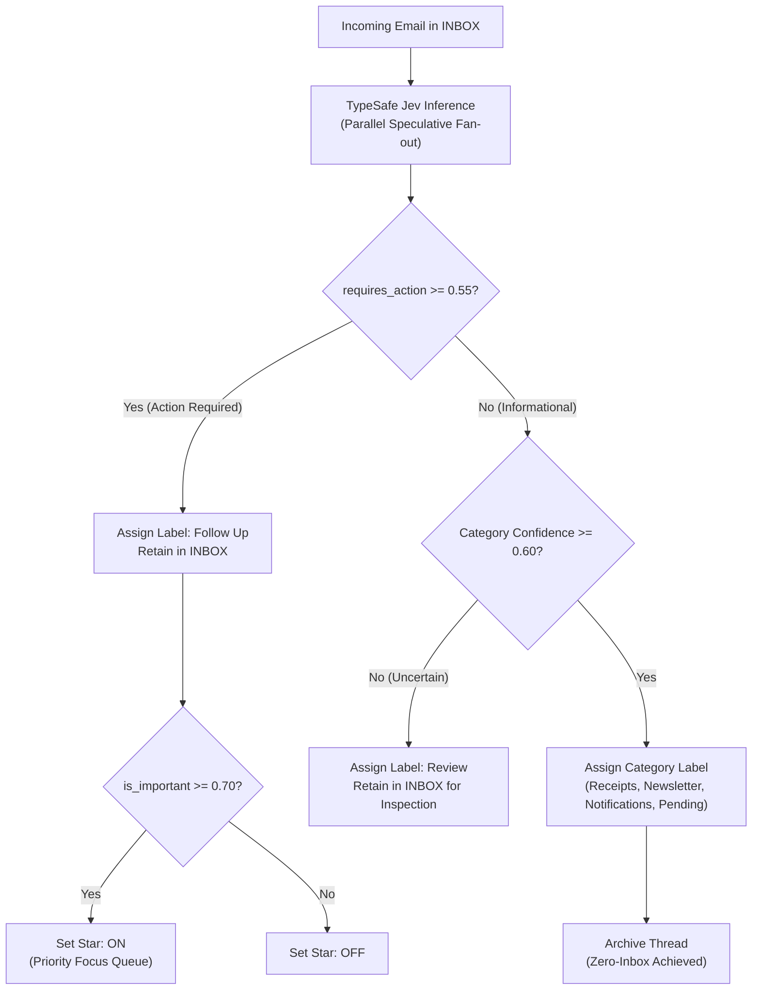

# AGENTS.md: Agent Operations and Deployment Manual for Jev-Mail

This document provides explicit instructions for coding agents (Claude Code, Antigravity, Cursor, Codex, Gemini CLI) to inspect, customize, test, and deploy Jev-Mail to a user's Google Apps Script (GAS) and Gmail environment in one shot.

---

## 1. Project Overview

Jev-Mail is a 24/7 autonomous Zero-Inbox triage system for Gmail.
It replaces keyword filters and generative LLM prompts with TypeSafe AI System One model (Jev).

### Architecture Overview



### System One (Jev) Primitives
1. Calibrated Probabilities (Noul): Returns mathematical probability (0.0 to 1.0) rather than text, enabling threshold-based decisions.
2. Low Latency: Sub-250ms decisions.
3. Deterministic: Pure classification and probability scoring without hallucination.

### Google Apps Script (GAS) Architecture
- Always-On Cloud Execution: Runs 24/7 on Google infrastructure at zero cost, even when the user's laptop is powered off.
- Native Gmail Integration: Uses GmailApp within Google permission sandbox with no token expiration.
- Trigger-Driven: 5-minute time-driven trigger runs automatically in the background.

---

## 2. Secure Credential Handling (Critical Protocol)

Never instruct the user to type their secret API key directly into plain chat prompts or commit it into repository files.

When handling credentials as an agent:
1. Check if `TYPESAFE_API_KEY` is already present in the local shell environment or in a local `.env` file.
2. If absent:
   - Prompt the user to enter it interactively via a masked terminal prompt:
     ```bash
     read -s -p "Enter TypeSafe API Key: " key && export TYPESAFE_API_KEY="$key"
     ```
   - Alternatively, instruct the user to create a `.env` file (which is gitignored) containing `TYPESAFE_API_KEY=your-key`.
3. For Google Apps Script deployment:
   - Instruct the user to save the key directly into **Project Settings -> Script Properties** with property name `TYPESAFE_API_KEY`.
   - Never print or log the key in stdout, test artifacts, or commit messages.

---

## 3. Two Operating Modes



### Mode 1: Default Template Mode
- Deploys the standard, battle-tested MECE Zero-Inbox taxonomy:
  - `Follow Up` (actionable, retained in INBOX, starred if urgent)
  - `Pending` (awaiting outcome, archived)
  - `Receipts` (financial invoices, archived)
  - `Newsletter` (reading content, archived)
  - `Notifications` (system alerts and verification codes, archived)
  - `Review` (low confidence fallback, retained in INBOX)
- Uses pre-built [gas/Code.gs](gas/Code.gs) directly without requiring local compilation.

### Mode 2: Custom Taxonomy Mode
- Use this mode when the user wants custom email categories, custom label names, or specific language localization (e.g. Korean labels).
- Protocol:
  1. Ask the user for their desired categories, labels, and archive behaviors.
  2. Update `taxonomy.config.json` with the user's category definitions.
  3. Execute `npm run generate` to compile customized `gas/Code.gs` and `src/config.ts`.
  4. Run `npm run simulate` to verify model responses against mock data.
  5. Deploy the compiled [gas/Code.gs](gas/Code.gs) to Google Apps Script.

---

## 4. Decision Pipeline Logic



1. If `requires_action >= 0.55`:
   - Label: Action label (default: `Follow Up`)
   - Archive: `false` (retained in Inbox)
   - Star: `true` if `is_important >= 0.70`, otherwise `false`
2. If `requires_action < 0.55`:
   - If `bucket.confidence < 0.60`:
     - Label: Review label (default: `Review`)
     - Archive: `false` (retained in Inbox for safety)
     - Star: `false`
   - Else:
     - Label: Category label defined in taxonomy config
     - Archive: Category archive policy (default: `true`)
     - Star: `false`

---

## 5. One-Shot Agent Deployment Protocol

When instructed to deploy Jev-Mail:

### Step 1: Pre-flight Verification
1. Securely obtain `TYPESAFE_API_KEY` following Section 2.
2. If Mode 2 is selected, update `taxonomy.config.json` and run:
   ```bash
   npm run generate
   ```
3. Run simulation verification:
   ```bash
   npm run simulate
   ```
   Confirm all scenarios pass with 100% success rate.

### Step 2: Google Apps Script Setup

#### Option A: Browser / Direct Deployment (Recommended)
1. Navigate the user to `https://script.google.com/home` and open or create project `Jev-Mail-Triage`.
2. Paste the contents of `gas/Code.gs`.
3. In **Project Settings -> Script Properties**, add `TYPESAFE_API_KEY`.
4. Select `installTrigger` from the function dropdown and run it once to establish the 5-minute cloud schedule.

#### Option B: CLASP CLI Deployment
1. Check clasp availability: `npx @google/clasp -v`
2. Authenticate: `npx @google/clasp login`
3. Push project code: `npx @google/clasp push`
4. Guide user to configure `TYPESAFE_API_KEY` in Script Properties.

### Step 3: Configure Gmail Settings
Guide the user through Gmail settings:
1. Open Gmail Settings -> **See all settings** -> **Inbox**.
2. Under **Importance markers**, select **No markers**.
3. Check **Don't use my past actions to predict importance**.
4. Save changes.

### Step 4: Optional Backlog Clean-Up
If the user has existing unorganized emails in their `INBOX`:
1. In Apps Script editor, run function `triageHistoricalInbox`.
2. All existing inbox emails will be categorized and archived without adding Star or Follow Up labels.
