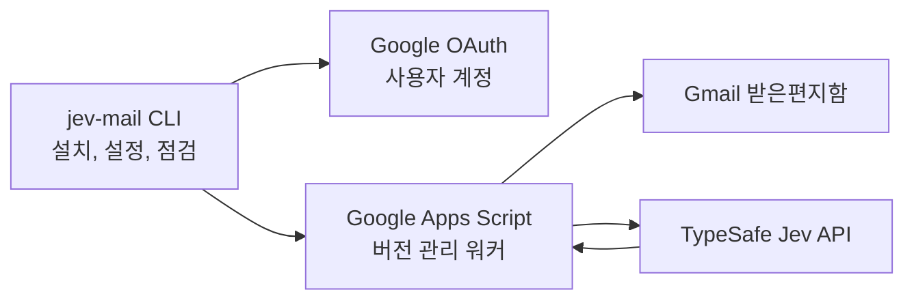

# Jev-Mail

> CLI로 설치하고 관리하는, GAS 기반으로 24시간 작동하는 Jev 모델 기반 Gmail 분류기

[English](README.md)

코딩 에이전트의 설치 안내를 받으려면 패키지에 포함된 [Jev-Mail 설치 스킬](skills/jev-mail-setup/SKILL.md)과 [온보딩 절차](docs/onboarding.md)를 사용하십시오. 사용자 소유 Google Cloud 프로젝트와 Desktop OAuth 클라이언트가 필요합니다. Google 로그인·동의와 Apps Script 편집기 승인은 사용자가 수행합니다. 권한을 받은 에이전트는 사용자 소유 Cloud 프로젝트 준비와 CLI 재개를 도울 수 있습니다.

[](LICENSE)
[](https://typesafe.ai)
[](https://script.google.com)

Jev-Mail은 Gmail 받은편지함을 분류하는 CLI 도구입니다. CLI가 버전이 관리되는 Google Apps Script 워커를 업로드하고, 워커가 Google의 시간 트리거로 받은편지함을 주기적으로 확인합니다. 컴퓨터를 꺼도 Google Apps Script가 실행되며, TypeSafe Jev의 typed 판단을 바탕으로 라벨, 별표, 아카이브를 적용합니다.

사용 흐름은 간단하게 유지합니다. 한 번 설치하고, 미리보기를 확인한 뒤, 워커를 활성화하면 일상적인 사용은 Gmail에서 이어집니다. 최초 기본 모드는 `label-only`입니다. 먼저 라벨만 적용해 결과를 확인한 다음 필요할 때 아카이브 모드를 켤 수 있습니다.

Jev-Mail은 완벽한 분류 정확도, 제로 설정, 고정된 응답 시간을 보장하지 않습니다. Jev의 판단은 확률적이며, 실제 받은편지함에서 확인해야 합니다. `preview`와 `Review`는 안전장치입니다.

## 동작 구조



CLI는 상시 실행되는 데몬이 아니며, 사용자 컴퓨터를 켜둘 필요도 없습니다. 실제 분류는 Google Apps Script가 담당합니다. Google 실행 API는 이 작업에 필요한 설치형 시간 트리거를 대신 만들어주지 않으므로, 최초 설치 때 Apps Script 편집기에서 `installTrigger`를 한 번 실행해야 합니다.

워커는 발신자, 수신자, 제목, 최대 1,000자의 본문 일부와 필요한 경우 제한된 이전 문맥을 Jev에 전달합니다. 다음 세 가지 typed 판단을 요청합니다.

- `requires_action`: 수신자가 회신, 결정, 승인, 작업을 해야 하는지.
- `is_important`: 조치가 필요한 메일에 별표를 붙일지.
- `bucket`: 조치가 필요하지 않은 메일의 설정된 카테고리.

워커는 확률을 검증한 뒤 Gmail을 변경합니다. 조치 가능성이 모호하거나, 카테고리 신뢰도가 낮거나, 알 수 없는 카테고리이거나, 처리 중 대화가 바뀌거나, 아카이브 조건이 완전하지 않으면 받은편지함에 남겨 `Review`로 보냅니다.

## 필요한 것

- CLI 실행을 위한 Node.js 22 이상.
- TypeSafe API 키.
- Gmail을 사용하는 Google 계정.
- Desktop OAuth 클라이언트를 보유하고 Apps Script API와 Gmail API가 활성화된 표준 Google Cloud 프로젝트.
- [Google Apps Script 사용자 설정](https://script.google.com/home/usersettings)에서 Apps Script API 활성화.

OAuth 동의 화면이 조직 전용(Internal)으로 제한되어 있으면 개인 Gmail 계정은 인증할 수 없습니다. 해당 조직의 Google Workspace 계정을 사용하거나, 동의 화면을 **External** 테스트로 설정하고 개인 계정을 테스트 사용자로 추가하십시오. 이 설정은 프로젝트 전체의 OAuth 클라이언트에 영향을 줄 수 있으므로 기존 클라이언트를 보존해야 한다면 Jev-Mail 전용 Cloud 프로젝트를 사용하는 편이 안전합니다. 자세한 내용은 Google의 [OAuth audience 안내](https://support.google.com/cloud/answer/15549945?hl=en)를 확인하십시오.

Google 안내에 따르면 Gmail 권한을 요청하는 External/Testing 앱의 테스트 사용자 승인과 오프라인 갱신 토큰은 7일 후 만료됩니다. 필요하면 기존 설치에서 `init --reauthorize`를 실행하십시오. 장기 무인 운영을 계획한다면 Google의 게시·검증 요건을 확인해야 합니다.

`init`에 전달하는 프로젝트 번호는 다운로드한 Desktop OAuth 클라이언트를 소유한 같은 Google Cloud 프로젝트의 숫자형 프로젝트 번호여야 합니다. OAuth 인증이 시작된 뒤 CLI가 프로젝트 불일치를 자동으로 고칠 수는 없습니다.

## 최초 설치

최초 설치에는 브라우저 승인과 Google 편집기 작업이 포함됩니다. 이는 로컬 백그라운드 프로세스가 아니라 Google 플랫폼의 설치 방식입니다.

### 1. Google Cloud 준비

표준 Google Cloud 프로젝트를 만들거나 선택한 뒤 다음을 진행합니다.

1. **Apps Script API**를 활성화합니다.
2. **Gmail API**를 활성화합니다.
3. OAuth 동의 화면을 설정하고, 테스트 모드라면 Jev-Mail을 사용할 Google 계정을 테스트 사용자로 추가합니다.
4. **Desktop app** OAuth 클라이언트를 만들고 JSON 파일을 다운로드합니다.
5. 프로젝트 세부정보에서 숫자형 **프로젝트 번호**를 복사합니다.

OAuth JSON 파일은 로컬에 보관하고 커밋하거나 채팅에 붙여넣지 마십시오.

### 2. CLI 시작

저장소를 내려받은 뒤 실행합니다.

```bash
npm install
npm run build
node dist/cli/main.js init \
  --credentials /absolute/path/to/client.json \
  --project-number 123456789012
```

브라우저에서 분류할 Gmail 계정으로 로그인하고 권한을 승인합니다. CLI 로컬 상태는 기본적으로 `~/.config/jev-mail`에 저장됩니다. 계정이나 설치를 분리하려면 `--home DIR`을 사용하십시오.

CLI는 GAS 프로젝트를 만들고 워커와 YAML 설정을 업로드한 뒤 버전이 관리되는 실행 배포를 만듭니다. 새 GAS 프로젝트를 같은 Google Cloud 프로젝트에 연결해야 하면 그 지점에서 안내와 함께 멈춥니다.

### 3. GAS 프로젝트 연결과 트리거 설치

`init`이 출력한 링크를 따라 진행합니다.

1. 새 Apps Script 프로젝트의 설정을 엽니다.
2. **Google Cloud Platform project**에서 **Change project**를 선택합니다.
3. `init`에 사용한 같은 숫자형 프로젝트 번호를 입력합니다.
4. Apps Script 편집기로 돌아가 함수 선택기에서 `installTrigger`를 선택하고 한 번 실행합니다.
5. Google의 권한 승인을 완료합니다.

트리거는 일시 정지된 상태로 만들어집니다. `enable`을 실행하기 전에는 메일을 분류하지 않습니다. 이 편집기 작업은 Apps Script API가 설치형 트리거 생성 기능을 제공하지 않기 때문에 필요합니다.

### 4. 설치 재개와 API 키 설정

같은 `init` 명령을 다시 실행합니다. CLI가 프로젝트 연결과 트리거를 확인한 뒤 TypeSafe 키를 마스킹된 입력으로 받습니다. 자동화 환경에서는 `init` 실행 전에 `TYPESAFE_API_KEY` 환경 변수를 설정할 수 있습니다. 키를 CLI 인자로 전달하지 마십시오.

키는 인증된 Google 실행 API를 통해 워커의 Script Properties에 저장됩니다. 저장소에 기록되거나 CLI 출력에 표시되지 않습니다.

### 5. 미리보기와 활성화

```bash
node dist/cli/main.js preview --limit 10
node dist/cli/main.js enable
node dist/cli/main.js status
```

`preview`는 Gmail을 변경하지 않고 Jev를 호출해 예상 결과를 보여줍니다. API 사용량은 발생합니다. 자동 분류를 활성화하기 전에 미리보기 결과를 확인하십시오.

정상적인 순서는 다음과 같습니다.

```text
init -> GAS 프로젝트 연결 -> installTrigger 실행 -> init 재실행 -> preview -> enable
```

## CLI 명령

패키지로 설치하면 `jev-mail` 명령을 사용할 수 있습니다. 저장소에서는 위 예시처럼 `node dist/cli/main.js`를 사용합니다.

| 명령 | 용도 |
| --- | --- |
| `init` | Google 인증, GAS 프로젝트 생성, 코드 업로드, 배포, 키 설정을 재개 가능하게 수행 |
| `preview --limit N` | Gmail을 변경하지 않고 받은편지함 최대 20개 스레드 분류 |
| `enable` | 예약된 분류 재개 |
| `disable` | 트리거를 유지하면서 예약 분류 일시 정지 |
| `status` | 실제 원격 트리거, 활성 상태, 계정, 최근 실행 확인 |
| `doctor --json` | 원격 변경과 모델 호출 없이 설치를 점검하고 `checks`와 `nextActions` 출력 |
| `doctor --verify-model` | API 사용량이 발생할 수 있는 명시적 TypeSafe 합성 검증 |
| `update` | 현재 워커 버전을 기존 GAS 배포에 업로드 |
| `config init` | 기본 YAML 설정 생성 |
| `config show` | 검증된 YAML 설정 출력 |
| `config validate` | 적용하지 않고 YAML 검증 |
| `config migrate --from OLD --config NEW` | 기존 JSON taxonomy를 새 label-only YAML로 변환하고 기존 파일은 덮어쓰지 않음 |
| `config edit` | 라벨과 카테고리 규칙을 대화형으로 변경 |
| `config apply` | 현재 YAML 정책을 업로드. 설정 변경만으로 기존 메일을 일괄 재분류하지 않음 |
| `config set-mode --mode label-only\|archive` | 아카이브 허용 모드 선택 |

주요 옵션:

```text
--home DIR       별도의 로컬 설치 디렉터리
--config FILE    기본 경로 대신 사용할 YAML 파일
--json           자동화를 위한 JSON 출력, 대화형 입력 비활성화
--replace-key    init에서 TypeSafe 키를 synthetic 검증 후 교체
--reauthorize    인증이 만료되거나 철회된 뒤 init에서 Google 재연결
--no-open        브라우저를 열지 않고 링크만 출력
```

에이전트가 설치를 이어갈 때 `doctor --json`은 `schemaVersion: 1`, `ok`, 각 검사 결과(`pass`, `blocked`, `unknown`), 사용자 또는 에이전트가 수행할 다음 작업을 제공합니다. 제안 명령은 인자 배열이므로 각 인자를 분리해 실행하십시오. OAuth 갱신 과정에서 로컬 토큰 파일은 바뀔 수 있습니다. 모든 명령에 같은 `--home`과 `--config`를 사용하십시오. 코드 업로드만으로 트리거나 모델 연결을 확인했다고 판단할 수 없습니다.

종료 코드는 자동화에서 사용할 수 있습니다. `0` 성공, `1` 예상하지 못한 오류, `2` 잘못된 사용법 또는 설정, `3` 인증 또는 Google 설정 필요, `4` 원격 실행 오류입니다.

## YAML 설정

Jev-Mail은 YAML을 사용합니다. 전체 예시는 [jev-mail.example.yaml](jev-mail.example.yaml)에 있습니다.

```yaml
version: 1
model: jev-latest

labels:
  action: Follow Up
  review: Review

thresholds:
  actionRequired: 0.55
  actionNotRequired: 0.2
  important: 0.7
  categoryConfidence: 0.6

categories:
  - key: finance
    label: Finance
    description: 인보이스, 결제 확인, 회계 관련 알림
    examples:
      - 구독 결제가 확인되었습니다
    archive: true

runtime:
  batchSize: 10
  maxScan: 100
  maxRuntimeSeconds: 240
  mode: label-only
  intervalMinutes: 5
```

주요 규칙:

- `actionRequired`는 `actionNotRequired`보다 커야 합니다.
- 조치 확률이 `actionRequired` 이상이면 action 라벨을 붙이고 인박스에 남깁니다. `important` 이상이면 별표를 붙입니다.
- 두 조치 임계값 사이의 확률은 모호한 것으로 보고 `Review`에 남깁니다.
- `actionNotRequired`보다 낮으면 Jev의 카테고리와 신뢰도를 사용합니다. 신뢰도가 낮거나 카테고리를 알 수 없으면 `Review`에 남깁니다.
- `label-only` 모드에서는 카테고리 라벨만 붙이고 아카이브하지 않습니다. `archive` 모드에서 카테고리의 `archive: true`가 아카이브를 허용합니다.
- action, Review, 카테고리 라벨은 서로 달라야 하며 `INBOX`, `SPAM`, `TRASH`, `STARRED` 같은 Gmail 시스템 라벨을 사용할 수 없습니다.
- 카테고리 키는 소문자, 숫자, 하이픈, 밑줄만 사용합니다. 알 수 없는 YAML 속성과 안전하지 않은 값은 업로드 전에 거절됩니다.

사용자 정의 파일을 계속 사용하려면 모든 명령에 `--config`를 전달합니다.

```bash
node dist/cli/main.js config validate --config ./jev-mail.yaml
node dist/cli/main.js init --config ./jev-mail.yaml --credentials /absolute/path/to/client.json --project-number 123456789012
node dist/cli/main.js config apply --config ./jev-mail.yaml
```

기존 `taxonomy.config.json`은 현재 CLI가 직접 읽지 않습니다. 다음 명령으로 새 YAML로 변환하십시오.

```bash
node dist/cli/main.js config migrate \
  --from ./taxonomy.config.json \
  --config ./jev-mail.yaml
node dist/cli/main.js config validate --config ./jev-mail.yaml
```

마이그레이션은 기존 출력 파일을 덮어쓰지 않으며 안전한 `label-only` 모드로 저장합니다. 생성된 YAML을 확인한 뒤 기존 아카이브 동작을 의도적으로 유지할 때만 `config set-mode --mode archive`를 사용하십시오.

설정을 바꾸면 워커가 사용하는 정책 fingerprint가 바뀝니다. 설정 변경만으로 기존 메일을 다시 분류하지는 않으며, 새 답장이나 이전에 처리되지 않은 메일에 현재 정책을 사용합니다.

## 운영 안전장치

워커는 GAS 스크립트 잠금으로 겹치는 실행을 막습니다. 처리한 스레드의 상태를 제한된 receipt로 기록해 완료된 메시지를 반복해서 Jev에 보내지 않으며, 새 답장이 오면 다시 평가합니다. 라벨이나 아카이브를 적용하기 직전에 Gmail 상태를 다시 확인합니다. 하나의 스레드에 여러 받은편지함 메시지가 있으면 평가하지 않은 메시지까지 아카이브하지 않고 `Review`로 남깁니다. receipt 용량은 유한하며, 한도에 도달하면 중복 분류를 피하기 위해 새 receipt 생성을 중단하고 `status`에 용량 상태를 표시합니다.

실패 시 제한된 재시도 backoff를 사용하며, 추론이 실패한 경우 Gmail 변경을 적용하지 않습니다. `disable`은 트리거를 삭제하지 않고 워커를 멈추므로 점검 후 재개할 수 있습니다.

처음에는 label-only 모드를 사용하십시오. 대표적인 메일의 preview 결과를 확인하고 분류 체계를 조정한 뒤 archive 모드를 선택하는 것이 안전합니다.

## 개인정보와 자격 증명

- CLI는 OAuth 클라이언트 메타데이터, refresh token, 설치 상태, YAML 설정을 기본 로컬 디렉터리에 저장합니다. 파일 권한은 제한적으로 생성되지만 운영체제 계정의 파일 보호도 필요합니다.
- TypeSafe 키는 GAS Script Properties에 저장하며 커밋하지 않습니다. 마스킹된 `init` 입력 또는 `TYPESAFE_API_KEY`를 사용하고 CLI 옵션으로 전달하지 마십시오.
- 워커는 분류를 위해 발신자, 수신자, 제목, 최대 1,000자의 본문 일부와 제한된 이전 문맥을 HTTPS로 TypeSafe API에 전송합니다. 민감한 메일을 사용하기 전 TypeSafe의 현재 약관과 보관 정책을 확인하십시오.
- 외부 데이터베이스는 사용하지 않습니다. GAS Script Properties에는 제한된 처리 receipt와 정책 fingerprint, 재시도 상태, 최근 실행 메타데이터가 남습니다. 임시 대기 및 실패 receipt는 약 180일 후 정리되며, 받은편지함에 남은 완료 receipt는 정책 변경 뒤 재분류를 막기 위해 유지됩니다. 아카이브된 스레드의 receipt는 약 1,200개 한도에 가까워지면 정리됩니다. 한도에 도달하면 새 receipt 생성이 중단되고 `status`에 상태가 표시됩니다. receipt에는 본문이 들어가지 않습니다.
- 오류 로그에는 운영 오류가 기록될 수 있습니다. 모든 규제 또는 조직 환경에 적합하다고 가정하지 마십시오.

## 개발

```bash
npm install
npm run typecheck
npm test
npm run build
npm run test:e2e
```

실제 TypeSafe 연결을 synthetic fixture로만 확인하려면 다음을 실행할 수 있습니다.

```bash
npm run simulate
```

환경 변수 또는 gitignore된 `.env` 파일에 `TYPESAFE_API_KEY`가 필요합니다. Gmail에는 접근하지 않으며, production 정확도를 증명하는 테스트가 아닙니다.

테스트에는 순수 core/config 테스트, GAS 워커 하네스, Google API와 OAuth 테스트, CLI 및 E2E 테스트가 포함됩니다. 테스트는 fixture와 mock을 사용하므로 실제 Gmail, Google Cloud 프로젝트, TypeSafe 계정의 연결 성공을 증명하지는 않습니다.

자세한 설치 체크리스트는 [docs/onboarding.md](docs/onboarding.md), 저장소 작업 규칙은 [CONTRIBUTING.md](CONTRIBUTING.md)를 확인하십시오.

## 라이선스

MIT. [LICENSE](LICENSE)를 참조하십시오.
