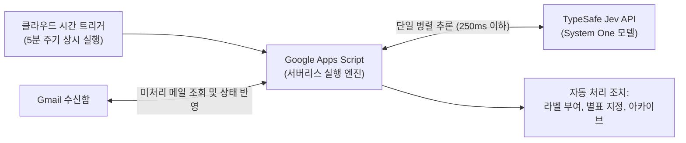
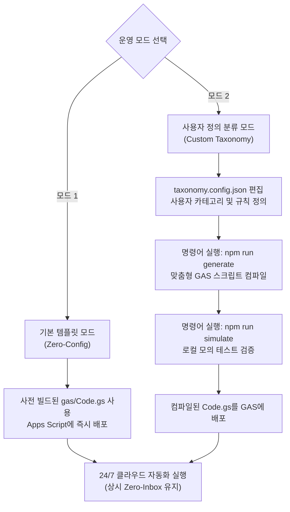
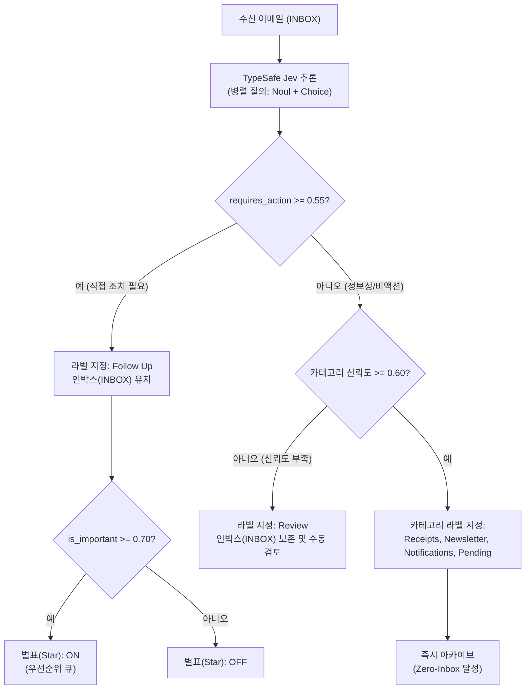

# Jev-Mail (한국어)

> TypeSafe Jev System One 기반의 Gmail 24/7 자동 Zero-Inbox 분류기.

[English](README.md) | [한국어](README.ko.md)

Jev-Mail은 Google Apps Script(GAS) 기반으로 구글 클라우드에서 상시 구동되는 자동 이메일 분류 시스템입니다. 컴퓨터 전원이 꺼져 있어도 5분마다 새 메일을 확인하고 분류, 라벨링, 아카이브를 수행합니다.

느리고 비용이 많이 드는 일반 생성형 LLM 텍스트 프롬프트 대신, TypeSafe AI의 System One 모델(`Jev`)을 활용합니다. 단 한 번의 API 호출(250ms 이하)로 조치 필요 여부(`Noul`), 긴급도(`Noul`), 카테고리(`Choice`)를 병렬 확률로 판정합니다.

---

## 아키텍처 개요



---

## 운영 모드

Jev-Mail은 두 가지 운영 모드를 지원합니다:



1. **모드 1: 기본 템플릿 모드 (Zero-Config)**
   - 철저히 검증된 MECE Zero-Inbox 기본 분류 체계(`Follow Up`, `Pending`, `Receipts`, `Newsletter`, `Notifications`, `Review`)를 사용합니다.
   - [gas/Code.gs](gas/Code.gs) 파일의 코드를 복사하여 즉시 배포할 수 있으며 별도의 로컬 빌드 도구가 필요하지 않습니다.

2. **모드 2: 사용자 정의 분류 모드 (Custom Taxonomy)**
   - `taxonomy.config.json` 파일을 통해 본인만의 이메일 카테고리, 분류 기준, 라벨명, 예시 문장, 아카이브 여부를 자유롭게 설정할 수 있습니다.
   - `npm run generate` 명령어로 맞춤형 Google Apps Script 코드와 TypeScript 설정 파일을 자동 생성합니다.
   - 배포 전 `npm run simulate`를 통해 로컬 가상 메일 시뮬레이션 검증을 수행할 수 있습니다.

---

## 의사결정 파이프라인

Jev-Mail은 메일의 수명 주기(Lifecycle)와 내용(Content)을 2축으로 분리하여 처리합니다.



### 기본 라벨 및 처리 기준

| 라벨명 | 대상 및 성격 | 판정 기준 | 별표 정책 | 인박스 보존 여부 |
| :--- | :--- | :--- | :---: | :---: |
| `Follow Up` | 직접 회신, 승인, 수동 작업이 필요한 업무 | 조치 필요 확률 0.55 이상 | 긴급 건(24시간 내)만 ON | 인박스 유지 |
| `Pending` | 회신 대기, 배송 추적, 티켓 처리 대기 | 외부 결과 대기 중인 상태 | OFF | 즉시 아카이브 |
| `Receipts` | 결제 영수증, 세금계산서, SaaS 인보이스 | 재무, 정산, 증빙 서류 | OFF | 즉시 아카이브 |
| `Newsletter` | 기술 블로그, 아티클, 주간 다이제스트 | 지식 및 정보성 읽을거리 | OFF | 즉시 아카이브 |
| `Notifications` | 깃허브 알림, CI/CD 빌드, 보안 인증번호, OTP | 기계 생성 시스템 알림 | OFF | 즉시 아카이브 |
| `Review` | 모델 신뢰도가 0.60 미만인 경계 케이스 | 수동 확인 필요 건 | OFF | 인박스 유지 |

---

## AI 코딩 에이전트를 통한 1-Shot 배포

Claude Code, Antigravity, Cursor, Codex 등의 코딩 에이전트를 사용 중이라면 아래 프롬프트를 에이전트에게 전달하십시오:

```markdown
https://github.com/vynnlee/jev-mail 의 AGENTS.md 를 읽고 내 Gmail 계정에 Jev-Mail을 세팅해줘.

보안 요구사항:
내 TypeSafe API 키를 이 채팅창에 직접 입력하게 하지 마라.
대신 터미널을 통한 안전한 대화형 입력(read -s 등)을 요청하거나, Google Apps Script 프로젝트 설정의 스크립트 속성에 직접 입력하도록 안내해라.

배포 모드 선택:
- 모드 1 (기본 템플릿): 표준 Zero-Inbox 분류 체계(Follow Up, Pending, Receipts, Newsletter, Notifications, Review) 배포.
- 모드 2 (맞춤형 분류): 내게 필요한 이메일 분류 항목을 질문하고 taxonomy.config.json을 생성한 뒤 컴파일하여 배포.

AGENTS.md에 정의된 절차를 단계별로 따라 진행해줘.
```

에이전트가 [AGENTS.md](AGENTS.md)를 읽고 API 키 유출 없이 전체 설치를 안전하게 완료합니다.

---

## 3분 수동 설치 가이드

### 1단계: TypeSafe API 키 발급
[TypeSafe AI 콘솔](https://typesafe.ai)에서 API 키를 발급받습니다.

### 2단계: Google Apps Script 프로젝트 생성
1. [script.google.com/home](https://script.google.com/home)에 접속하여 **새 프로젝트**를 생성합니다.
2. 프로젝트 이름을 `Jev-Mail-Triage`로 변경합니다.
3. `Code.gs` 내용을 [gas/Code.gs](gas/Code.gs) 또는 한국어 라벨용 [templates/Code-korean.gs](templates/Code-korean.gs)의 코드로 교체합니다.
4. 저장(`Cmd+S` 또는 `Ctrl+S`)합니다.

### 3단계: 스크립트 속성에 API 키 추가
1. 좌측 메뉴에서 **프로젝트 설정**(톱니바퀴 아이콘)을 클릭합니다.
2. 하단 **스크립트 속성**에서 **스크립트 속성 추가**를 누릅니다.
3. 다음 값을 입력합니다:
   - 속성: `TYPESAFE_API_KEY`
   - 값: `<발급받은_API_키>`
4. **스크립트 속성 저장**을 클릭합니다.

### 4단계: 24/7 자동 실행 트리거 설치
1. 좌측 메뉴에서 **편집기**(`< >` 아이콘)로 돌아옵니다.
2. 상단 툴바 함수 드롭다운에서 `installTrigger`를 선택합니다.
3. **실행**을 누릅니다.
4. Google 계정 권한 승인 창이 뜨면 권한을 허용합니다.
5. 실행 로그에 `[OK] 24/7 trigger installed successfully`가 출력되면 정상 완료입니다. 이제 5분마다 백그라운드에서 자동 분류가 실행됩니다.

### 5단계: (선택 사항) 받은편지함 기존 메일 일괄 정리
현재 `INBOX`에 쌓여 있는 과거 메일들을 한 번에 정리하려면:
1. 함수 드롭다운에서 `triageHistoricalInbox`를 선택합니다.
2. **실행**을 누릅니다.
3. 모든 기존 메일이 카테고리별로 분류되고 즉시 아카이브됩니다. (과거 메일에는 별표나 Follow Up 라벨이 부여되지 않습니다.)

---

## 맞춤형 분류 체계 커스텀 (모드 2)

나만의 이메일 카테고리와 분류 규칙을 적용하는 방법:

1. `taxonomy.config.json` 파일을 수정합니다:
   ```json
   {
     "action_label": "Follow Up",
     "review_label": "Review",
     "thresholds": {
       "requires_action": 0.55,
       "is_important": 0.70,
       "min_confidence": 0.60
     },
     "categories": [
       {
         "key": "finance",
         "label": "정산 및 영수증",
         "archive": true,
         "description": "세금계산서, 결제 영수증, 은행 알림, 정산 내역",
         "examples": ["전자세금계산서 발행 완료", "카드 승인 내역"]
       },
       {
         "key": "team",
         "label": "사내 알림",
         "archive": true,
         "description": "지라 티켓 업데이트, 슬랙 알림, 사내 공지",
         "examples": ["[Jira] 이슈 할당됨", "신규 공지사항"]
       }
     ]
   }
   ```

2. 맞춤형 Apps Script 코드 및 설정을 컴파일합니다:
   ```bash
   npm run generate
   ```

3. 가상 시뮬레이션으로 검증합니다:
   ```bash
   TYPESAFE_API_KEY="your-api-key" npm run simulate
   ```

4. 생성된 [gas/Code.gs](gas/Code.gs) 코드를 Google Apps Script 프로젝트에 붙여넣습니다.

---

## 권장 Gmail 환경설정

Google의 기본 중요도 마커는 뉴스레터나 시스템 알림을 자주 오분류합니다.

1. Gmail 설정(톱니바퀴) -> **모든 설정 보기** -> **받은편지함**.
2. **중요도 표시** 항목에서 **마커 표시 안함**을 선택합니다.
3. **내 이전 작업을 사용하여 중요도를 예측하지 않음**을 선택합니다.
4. 변경사항을 저장합니다.

Jev-Mail은 중요도 판정 점수(`is_important >= 0.70`)가 높은 긴급 업무 메일에만 **별표(Star)**를 부여하여, 별표편지함을 직관적인 데일리 우선순위 큐로 활용합니다.

---

## 보안 및 개인정보 보호

- 이메일 데이터 무저장: 어떤 외부 데이터베이스에도 이메일 본문이나 메타데이터를 저장하지 않습니다.
- 개인 계정의 안전한 구글 클라우드 컨테이너(Google Apps Script) 내에서만 실행됩니다.
- API 키는 구글 스크립트 속성에 암호화되어 보관됩니다. 채팅 프롬프트에 API 키를 노출하지 마십시오.
- TypeSafe AI 추론 호출 시에만 발신자, 제목, 본문 일부(최대 1,000자)가 암호화된 TLS 통신으로 전달됩니다.
