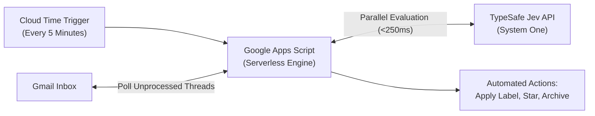
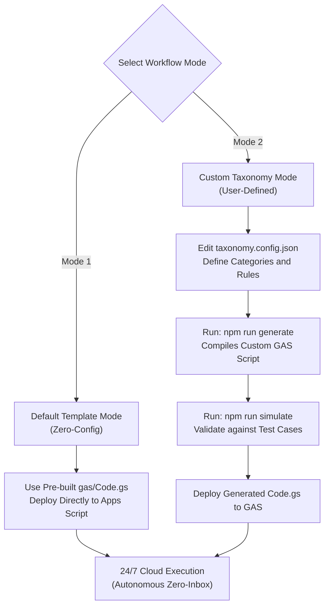
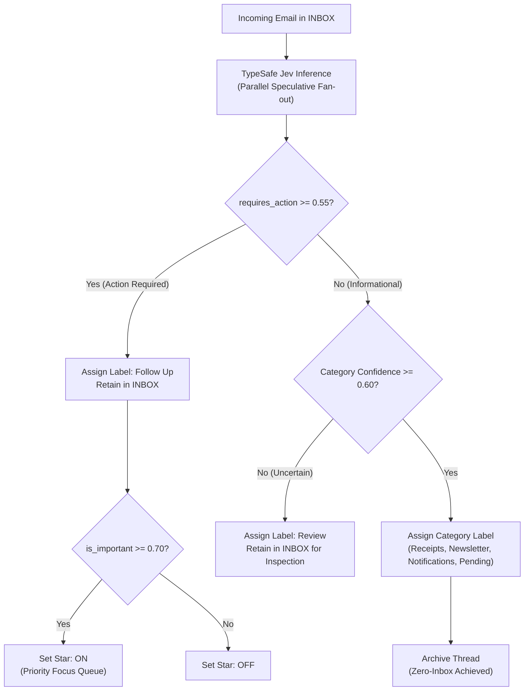

# Jev-Mail

> Autonomous 24/7 Zero-Inbox triage for Gmail powered by TypeSafe Jev System One.

[English](README.md) | [한국어](README.ko.md)

[](LICENSE)
[](https://typesafe.ai)
[](https://script.google.com)
[]()
[](https://www.typescriptlang.org)

Jev-Mail is an always-on email triage system for Gmail. Running serverless inside Google Apps Script (GAS), it processes incoming emails every 5 minutes on Google Cloud infrastructure even when your computer is off.

Instead of slow, generative LLM text prompts or brittle regex filters, Jev-Mail uses TypeSafe AI System One model (`Jev`). A single inference call evaluates parallel typed questions: action necessity (`Noul`), urgency (`Noul`), and taxonomy category (`Choice`) with calibrated probabilities in under 250 ms.

---

## Architecture Overview



---

## Operating Modes

Jev-Mail supports two deployment modes:



1. **Mode 1: Default Template Mode (Zero-Config)**
   - Ships with a battle-tested, MECE Zero-Inbox taxonomy (`Follow Up`, `Pending`, `Receipts`, `Newsletter`, `Notifications`, `Review`).
   - Ready-to-deploy pre-compiled script in [gas/Code.gs](gas/Code.gs).
   - Zero local build tools or dependencies required.

2. **Mode 2: Custom Taxonomy Mode (User-Defined)**
   - Allows full customization of email categories, criteria, labels, examples, and archive rules in `taxonomy.config.json`.
   - Compiles custom Google Apps Script code and TypeScript definitions via `npm run generate`.
   - Enables pre-deployment verification using local mock email simulation (`npm run simulate`).

---

## Decision Pipeline

Jev-Mail evaluates incoming emails across two orthogonal axes: Lifecycle (System Mailboxes) and Content (Custom Labels).



### Default Taxonomy Matrix

| Label | Description | Criteria | Star Policy | Inbox Lifecycle |
| :--- | :--- | :--- | :---: | :---: |
| `Follow Up` | Direct human action required | Reply, decision, sign-off, or manual task needed | Starred if urgent (<24h) | Retained in INBOX |
| `Pending` | Awaiting external outcome | Waiting on response, package in transit, ticket update | None | Archived |
| `Receipts` | Financial and legal notices | Invoices, Stripe/bank alerts, SaaS subscriptions | None | Archived |
| `Newsletter` | Reading material | Technical digests, blogs, product updates, marketing | None | Archived |
| `Notifications` | Machine and telemetry alerts | GitHub/Jira pings, CI/CD builds, verification codes, OTPs, password resets | None | Archived |
| `Review` | Low-confidence safety boundary | Confidence score below 0.60 | None | Retained in INBOX |

---

## 1-Shot Agent Deployment

If you use an AI coding agent (Claude Code, Antigravity, Cursor, Codex, Gemini CLI), copy and paste this instruction block:

```markdown
Read AGENTS.md in https://github.com/vynnlee/jev-mail and set up Jev-Mail on my Gmail account.

Security Requirement:
Do not ask me to enter or expose my TypeSafe API key in this chat prompt.
Instead, prompt me to enter it interactively via terminal or secure input, or guide me to paste it directly into Google Apps Script Project Settings.

Choose deployment mode:
- Mode 1 (Default): Deploy standard Zero-Inbox taxonomy (Follow Up, Pending, Receipts, Newsletter, Notifications, Review).
- Mode 2 (Custom): Ask me for my desired email categories and compile a custom taxonomy.config.json before deployment.

Follow the instructions in AGENTS.md step by step.
```

The agent will parse [AGENTS.md](AGENTS.md) and handle setup securely without leaking your API key.

---

## Manual Setup

Setup takes under 3 minutes with zero local tooling required:

### Step 1: Obtain a TypeSafe API Key
Sign up at [TypeSafe AI](https://typesafe.ai) and generate an API key.

### Step 2: Create Google Apps Script Project
1. Open [script.google.com/home](https://script.google.com/home) and click **New project**.
2. Name the project `Jev-Mail-Triage`.
3. Replace the contents of `Code.gs` with [gas/Code.gs](gas/Code.gs) (or [templates/Code-korean.gs](templates/Code-korean.gs) for Korean folder names).
4. Save the project (`Cmd+S` or `Ctrl+S`).

### Step 3: Configure Script Properties
1. In the left sidebar, click **Project Settings** (gear icon).
2. Scroll to **Script Properties** and click **Add script property**.
3. Add:
   - Property: `TYPESAFE_API_KEY`
   - Value: `<your-api-key>`
4. Click **Save script properties**.

### Step 4: Install 24/7 Automation Trigger
1. Return to the **Editor** (`< >` icon).
2. Select `installTrigger` from the function dropdown on the top toolbar.
3. Click **Run**.
4. Complete Google's one-time permission approval.
5. A confirmation message `[OK] 24/7 trigger installed successfully` appears in the execution log. Google Cloud will now run the triage function every 5 minutes.

### Step 5: (Optional) Initial Backlog Triage
To categorize and clear existing emails currently sitting in your `INBOX`:
1. Select `triageHistoricalInbox` from the function dropdown.
2. Click **Run**.
3. All existing inbox emails are categorized into category labels and archived immediately. Star and Follow Up labels are never applied to historical emails.

---

## Customizing Taxonomy (Mode 2)

To define your own custom email categories and routing rules:

1. Edit `taxonomy.config.json`:
   ```json
   {
     "action_label": "Follow Up",
     "review_label": "Review",
     "thresholds": {
       "requires_action": 0.55,
       "is_important": 0.70,
       "min_confidence": 0.60
     },
     "categories": [
       {
         "key": "finance",
         "label": "Finance",
         "archive": true,
         "description": "Invoices, payment receipts, banking alerts, tax documents",
         "examples": ["Invoice #4021 attached", "Payment confirmed"]
       },
       {
         "key": "updates",
         "label": "Updates",
         "archive": true,
         "description": "Team notifications, Jira tickets, system alerts",
         "examples": ["[Jira] Issue assigned", "Deployment succeeded"]
       }
     ]
   }
   ```

2. Compile your custom Google Apps Script and TypeScript config:
   ```bash
   npm run generate
   ```

3. Validate with local simulation:
   ```bash
   TYPESAFE_API_KEY="your-api-key" npm run simulate
   ```

4. Deploy the generated [gas/Code.gs](gas/Code.gs) to your Google Apps Script project.

---

## Recommended Gmail Configuration

Google's default "Important" marker relies on heuristic algorithms that frequently misclassify newsletters or automated alerts.

1. Open Gmail Settings (gear icon) -> **See all settings** -> **Inbox**.
2. Under **Importance markers**, select **No markers**.
3. Under **Don't use my past actions to predict importance**, check the box.
4. Save changes.

Jev-Mail uses the Starred mailbox exclusively for emails where `is_important >= 0.70`, turning Starred into your daily priority queue.

---

## Local Verification

You can simulate decisions locally against mock email scenarios:

```bash
git clone https://github.com/vynnlee/jev-mail.git
cd jev-mail
npm install
npm run build
TYPESAFE_API_KEY="your-api-key" npm run simulate
```

### Sample Output

```text
=============================================================
Jev-Mail: System One Zero-Inbox Simulator
=============================================================

Loaded 7 mock email scenarios.
Evaluating with Jev (jev-latest)...

┌─────────┬───────────┬───────────────────────────────────────┬─────────────────┬───────┬─────────┬─────────┬────────┐
│ (index) │ id        │ subject                               │ label           │ star  │ archive │ latency │ status │
├─────────┼───────────┼───────────────────────────────────────┼─────────────────┼───────┼─────────┼─────────┼────────┤
│ 0       │ 'mock_01' │ '[Urgent] Q3 Roadmap approval nee...' │ 'Follow Up'     │ 'YES' │ 'NO'    │ '772ms' │ 'PASS' │
│ 1       │ 'mock_02' │ 'Question regarding webhook integ...' │ 'Follow Up'     │ 'NO'  │ 'NO'    │ '786ms' │ 'PASS' │
│ 2       │ 'mock_03' │ 'Your package #KR-98214 has shipp...' │ 'Pending'       │ 'NO'  │ 'YES'   │ '273ms' │ 'PASS' │
│ 3       │ 'mock_04' │ 'Your receipt for Cloud Invoice #...' │ 'Receipts'      │ 'NO'  │ 'YES'   │ '290ms' │ 'PASS' │
│ 4       │ 'mock_05' │ 'Issue #142: How System One model...' │ 'Newsletter'    │ 'NO'  │ 'YES'   │ '249ms' │ 'PASS' │
│ 5       │ 'mock_06' │ '[GitHub] Pull request #84 merged...' │ 'Notifications' │ 'NO'  │ 'YES'   │ '309ms' │ 'PASS' │
│ 6       │ 'mock_07' │ 'Your security verification code:...' │ 'Notifications' │ 'NO'  │ 'YES'   │ '486ms' │ 'PASS' │
└─────────┴───────────┴───────────────────────────────────────┴─────────────────┴───────┴─────────┴─────────┴────────┘

Simulation complete. All decisions verified against taxonomy.
```

---

## Repository Structure

```text
jev-mail/
├── README.md               # English documentation
├── README.ko.md            # Korean documentation
├── AGENTS.md               # Agent deployment instructions
├── CONTRIBUTING.md         # Contribution guidelines
├── LICENSE                 # MIT License
├── package.json            # Scripts and configuration
├── tsconfig.json           # TypeScript configuration
├── taxonomy.config.json    # Active taxonomy configuration
├── taxonomy.default.json   # Default taxonomy backup reference
├── scripts/
│   └── generate.js         # Generator for GAS code and TS configs
├── gas/
│   ├── Code.gs             # Google Apps Script production code
│   └── appsscript.json     # Apps Script manifest and scopes
├── templates/
│   ├── Code-english.gs     # Standalone English template
│   └── Code-korean.gs      # Standalone Korean template
├── src/
│   ├── types.ts            # TypeScript interfaces
│   ├── config.ts           # Auto-generated config constants
│   ├── triage.ts           # Jev payload builder and decision logic
│   └── cli.ts              # Local simulation harness
└── examples/
    └── mock-emails.json    # Test suite covering taxonomy edge cases
```

---

## Security and Privacy

- Zero persistent email storage: No emails or metadata are stored in external databases.
- Execution occurs strictly inside your private Google Apps Script container.
- API keys are stored in encrypted Google Script Properties. Never expose API keys in chat prompts.
- Inference payload transmits only sender, subject, and a truncated snippet (up to 1,000 characters) over TLS directly to TypeSafe AI.

---

## License

MIT License. See [LICENSE](LICENSE) for details.
Author: [Vynn Lee](https://github.com/vynnlee).
