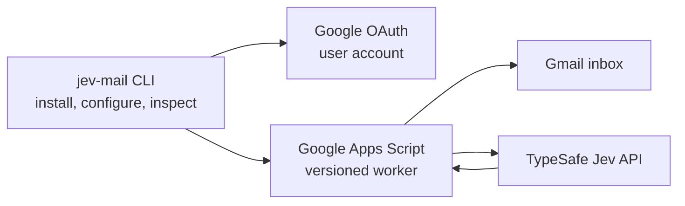

# Jev-Mail

> CLI-installed and CLI-managed Gmail classification that runs continuously on Google Apps Script with the TypeSafe Jev model.

[](LICENSE)
[](https://typesafe.ai)
[](https://script.google.com)
[](https://www.typescriptlang.org)

[English](README.md) | [Korean](README.ko.md)

> [!IMPORTANT]
> For guided installation by a coding agent, use the packaged [Jev-Mail setup skill](skills/jev-mail-setup/SKILL.md) and the [step-by-step onboarding guide](docs/onboarding.md). The installation uses your own Google Cloud project and Desktop OAuth client. You complete Google sign-in, consent, and the Apps Script editor approval; an authorized agent can help with Cloud project setup and resume the CLI after each handoff.

Jev-Mail is a small Gmail inbox classifier with a CLI for installation, configuration, preview, and operations. The CLI uploads a versioned Google Apps Script worker. The worker polls the Gmail inbox on a Google time trigger, asks Jev for typed judgments, and applies labels, stars, and archive decisions even when the user's computer is off.

The visible workflow stays simple: install once, inspect a preview, enable the worker, and use Gmail as the daily interface. The default onboarding mode is label-only so the first run can be observed safely. Archiving is an explicit configuration choice.

Jev-Mail does not promise perfect classification, zero setup, or a fixed response time. The model decision is probabilistic and should be evaluated on the user's mail. Preview and Review are part of the safety boundary.

## How it works



The CLI is not a daemon and the user's computer does not need to stay on. Google Apps Script performs the scheduled work. A one-time editor action is required because Google's execution API does not create installable time triggers for this workflow.

For each inbox thread, Jev receives the sender, recipient, subject, a bounded body snippet, and limited previous context when needed. The worker asks for three typed judgments:

- `requires_action`: whether the recipient needs to reply, decide, approve, or perform a task.
- `is_important`: whether an action item deserves a star.
- `bucket`: which configured category best describes a non-action message.

The worker validates returned probabilities before making a Gmail change. An ambiguous action probability, low category confidence, unknown category, changed thread, or partial archive condition stays in the inbox for review.

## Requirements

- Node.js 22 or newer for the CLI.
- A TypeSafe API key.
- A Google account with Gmail.
- A Google Cloud project that owns a Desktop OAuth client and has the Apps Script API and Gmail API enabled.
- Apps Script API enabled from [Google Apps Script user settings](https://script.google.com/home/usersettings).

If the OAuth consent screen is restricted to an organization, a personal Gmail account cannot authorize it. Use a Google Workspace account in that organization, or configure the consent screen for **External** testing and add the personal account as a test user. This is a project-wide audience setting and can affect other OAuth clients in the project; a dedicated Jev-Mail Cloud project is safer when existing clients must remain unchanged. See Google's [OAuth audience guidance](https://support.google.com/cloud/answer/15549945?hl=en).

For an External app in Testing with Gmail scopes, Google says test-user authorization and an offline refresh token expire after seven days. Reauthorize the same installation with `init --reauthorize` when needed. This limits unattended CLI access; review Google's publishing and verification requirements before relying on long-term authorization.

The Google Cloud project number used during `init` must be the numeric project number of the same project that owns the downloaded Desktop OAuth client. The CLI cannot repair a mismatch after authorization has started.

## First installation

The install flow deliberately has a browser step and a Google editor step. This is a Google platform requirement, not a local background service.

### 1. Prepare Google Cloud

Create or select a standard Google Cloud project. In that project:

1. Enable the **Apps Script API**.
2. Enable the **Gmail API**.
3. Configure the OAuth consent screen and add the Google account that will use Jev-Mail as a test user when the app is in testing mode.
4. Create a **Desktop app** OAuth client and download its JSON file.
5. Copy the numeric **Project number** from the project details page.

Keep the OAuth JSON local. Do not commit it or paste it into chat.

### 2. Build and start the CLI

From a checkout:

```bash
npm install
npm run build
node dist/cli/main.js init \
  --credentials /absolute/path/to/client.json \
  --project-number 123456789012
```

When the browser opens, sign in to the Google account whose Gmail inbox will be classified and approve the requested scopes. The CLI stores local state under `~/.config/jev-mail` by default. Use `--home DIR` for a separate account or installation.

The CLI creates a GAS project, uploads the worker and your YAML configuration, and creates a versioned execution deployment. It then pauses if the new GAS project still needs to be linked to the same Google Cloud project.

### 3. Link the GAS project and install its trigger

Follow the URLs printed by `init`:

1. Open the new Apps Script project settings.
2. Under **Google Cloud Platform project**, choose **Change project**.
3. Enter the same numeric project number used in the `init` command.
4. Return to the Apps Script editor, choose `installTrigger` in the function selector, and run it once.
5. Complete Google's permission approval.

The trigger is created in a paused state. It does not classify mail until `enable` is run. The editor action is intentional because the Apps Script API does not expose installable trigger creation for this workflow.

### 4. Resume onboarding and configure the key

Run the same `init` command again. The CLI verifies the linked project and trigger, then asks for the TypeSafe key through a masked prompt. For automation, set `TYPESAFE_API_KEY` in the environment before running `init`; never put the key in a command-line argument.

The key is sent over the authenticated Google execution API to the worker's Script Properties. It is not written to the repository or printed by the CLI.

### 5. Preview, then enable

```bash
node dist/cli/main.js preview --limit 10
node dist/cli/main.js enable
node dist/cli/main.js status
```

`preview` calls Jev and shows intended decisions without changing Gmail. API usage still applies. Inspect the preview before enabling automatic processing.

The normal operating sequence is:

```text
init -> link the GAS project -> installTrigger -> init again -> preview -> enable
```

## CLI reference

The published package exposes the `jev-mail` executable. In a repository checkout, use `node dist/cli/main.js` as shown above.

| Command | Purpose |
| --- | --- |
| `init` | Resume-safe Google authorization, GAS project creation, upload, deployment, and key configuration |
| `preview --limit N` | Classify up to 20 inbox threads without changing Gmail |
| `enable` | Resume scheduled classification |
| `disable` | Pause scheduled classification while retaining the trigger |
| `status` | Read the actual remote trigger, enabled state, account, and last run |
| `doctor --json` | Diagnose setup without remote changes or model calls; return structured `checks` and `nextActions` for resuming an install |
| `doctor --verify-model` | Explicit synthetic TypeSafe verification, which may use API quota |
| `update` | Publish the current worker version to the existing GAS deployment |
| `config init` | Write a default YAML configuration |
| `config show` | Print the validated YAML configuration |
| `config validate` | Validate YAML without applying it |
| `config migrate --from OLD --config NEW` | Convert legacy JSON taxonomy to a new label-only YAML file without overwriting it |
| `config edit` | Interactively change labels and category rules |
| `config apply` | Upload the current YAML policy without reclassifying old mail solely because settings changed |
| `config set-mode --mode label-only\|archive` | Choose whether eligible category mail may be archived |

Useful options:

```text
--home DIR       Use a separate local installation directory
--config FILE    Read and write this YAML file instead of the default config
--json           Emit machine-readable output and disable interactive prompts
--replace-key    Validate and replace the TypeSafe key during init
--reauthorize    Reconnect Google during init after revoked or expired authorization
--no-open        Print browser links without opening them
```

For agent handoffs, `doctor --json` reports `schemaVersion: 1`, `ok`, checks with `pass`, `blocked`, or `unknown` status, and next actions assigned to `user` or `agent`. Suggested commands are argument arrays; preserve their separate arguments when running them. OAuth refresh may update the local token file. Keep the same `--home` and `--config` on every command. A script upload alone does not prove that the trigger or model connection works.

Exit codes are stable for automation: `0` success, `1` unexpected failure, `2` invalid usage or configuration, `3` authorization or Google setup is needed, and `4` remote execution failure.

## Configuration

Jev-Mail uses YAML. The complete example is [jev-mail.example.yaml](jev-mail.example.yaml). A configuration contains the model, two system labels, thresholds, category labels, and the GAS runtime policy.

```yaml
version: 1
model: jev-latest

labels:
  action: Follow Up
  review: Review

thresholds:
  actionRequired: 0.55
  actionNotRequired: 0.2
  important: 0.7
  categoryConfidence: 0.6

categories:
  - key: finance
    label: Finance
    description: Invoices, payment confirmations, and accounting notices
    examples:
      - Payment confirmation for a subscription
    archive: true

runtime:
  batchSize: 10
  maxScan: 100
  maxRuntimeSeconds: 240
  mode: label-only
  intervalMinutes: 5
```

Configuration rules:

- `actionRequired` must be greater than `actionNotRequired`.
- An action probability at or above `actionRequired` receives the action label and stays in the inbox. `important` controls starring.
- A probability between the two action thresholds is ambiguous and receives the Review label.
- Below `actionNotRequired`, Jev's category and confidence are used. Low confidence or an unknown category receives Review.
- In `label-only` mode, category labels are applied but no message is archived. In `archive` mode, a category's `archive: true` permits archiving.
- Action and Review labels must be distinct from one another, every category label, and Gmail system labels such as `INBOX`, `SPAM`, `TRASH`, and `STARRED`.
- Category keys use lowercase letters, numbers, hyphens, and underscores. Unknown YAML properties and unsafe values are rejected before upload.

To use a custom file throughout the lifecycle:

```bash
node dist/cli/main.js config validate --config ./jev-mail.yaml
node dist/cli/main.js init --config ./jev-mail.yaml --credentials /absolute/path/to/client.json --project-number 123456789012
node dist/cli/main.js config apply --config ./jev-mail.yaml
```

The older `taxonomy.config.json` and generator workflow are not read by the current CLI. Convert an existing file with the migration command:

```bash
node dist/cli/main.js config migrate \
  --from ./taxonomy.config.json \
  --config ./jev-mail.yaml
node dist/cli/main.js config validate --config ./jev-mail.yaml
```

Migration refuses to overwrite an existing output file and writes a safe `label-only` runtime mode. Review the generated YAML, then use `config set-mode --mode archive` only when the old archive behavior is intentionally desired.

Changing the policy changes the fingerprint used by the worker. Existing completed messages are not reclassified merely because the YAML changed; a new reply or a previously unprocessed message is evaluated under the current policy.

## Runtime safety

The worker uses a GAS script lock to prevent overlapping runs. It records bounded per-thread receipts so a completed message is not repeatedly sent to Jev and a new reply can be evaluated. Gmail state is checked again before applying a label or archive operation. Mixed threads with multiple inbox messages are left for Review rather than archiving an unevaluated message. Receipt capacity is finite by design; when it is reached, the worker fails closed for new receipts and exposes the capacity state in `status` instead of risking duplicate classification.

Failures use bounded retry backoff and do not apply a Gmail mutation when inference fails. `disable` pauses the worker without deleting its trigger, so it can be resumed after inspection.

The default label-only mode is recommended for first use. Enable archive mode only after reviewing representative previews and adjusting the taxonomy for the account.

## Privacy and credentials

- The CLI stores OAuth client metadata, refresh tokens, installation state, and YAML configuration under the local CLI home. Files are written with restrictive permissions. The OAuth client JSON and token files must still be protected by the operating system account.
- The TypeSafe key is stored in GAS Script Properties and is never committed. Use the masked `init` prompt or `TYPESAFE_API_KEY`; never pass it as a CLI option.
- The worker sends the sender, recipient, subject, a body snippet capped at 1,000 characters, and limited previous context to the TypeSafe API over HTTPS for classification. Check TypeSafe's current terms and retention policy before using the tool with sensitive mail.
- Jev-Mail does not use an external database. GAS Script Properties retain bounded processing receipts, policy fingerprints, retry state, and last-run metadata. Temporary pending and failure receipts are age-evicted after about 180 days. Completed receipts for retained inbox threads are kept so older mail is not silently classified again under a changed policy; receipts for archived threads are pruned as capacity approaches roughly 1,200 entries. At capacity, new receipt creation fails closed and `status` reports the condition. Receipts do not contain message bodies.
- Error logs contain operational errors only. Do not assume this makes the integration suitable for every regulatory or organizational context.

## Development

```bash
npm install
npm run typecheck
npm test
npm run build
npm run test:e2e
```

For an optional live check against synthetic fixtures only:

```bash
npm run simulate
```

This requires `TYPESAFE_API_KEY` in the environment or a gitignored `.env` file. It calls TypeSafe, never Gmail, and reports fixture behavior rather than production accuracy.

The test suite includes pure core/config tests, a GAS worker harness, Google API and OAuth tests, and CLI/E2E checks. Tests use fixtures and mocks; they do not prove that a live Gmail account, Google Cloud project, or TypeSafe account is configured correctly.

See [CONTRIBUTING.md](CONTRIBUTING.md) for the repository workflow and [docs/onboarding.md](docs/onboarding.md) for the full first-install checklist.

## License

MIT. See [LICENSE](LICENSE).
