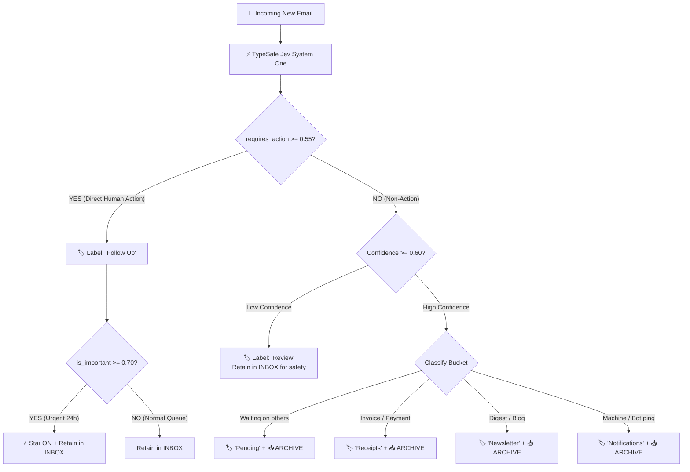

<div align="center">

# 📬 Jev-Mail
### Autonomous 24/7 Zero-Inbox Triage for Gmail Powered by TypeSafe AI System One

[](https://opensource.org/licenses/MIT)
[-orange.svg)](https://typesafe.ai)
[-green.svg)](https://script.google.com)
[]()
[](https://www.typescriptlang.org)

<p align="center">
  <b>Never sort your Gmail again.</b><br>
  Always-on, cloud-native inbox triage that runs even when your computer is off.<br>
  Classifies, labels, prioritizes (⭐), and archives incoming emails in under 250ms.
</p>

[English](#english) • [한국어 가이드](#korean) • [1-Shot Agent Setup](#1-shot-deployment-with-coding-agents) • [Templates](#ready-to-use-templates)

---

</div>

<a name="english"></a>
## ⚡ Why Jev-Mail?

Traditional Gmail filters are brittle and break constantly. Generative LLMs (GPT-4o, Claude) are slow (3~8s), expensive ($0.03+/email), and hallucinate.

**Jev-Mail** is powered by **TypeSafe AI's System One model (`Jev`)**:
- 🚀 **Sub-250ms Latency**: 10x faster than traditional LLMs.
- 📐 **Calibrated Probabilities (`noul`)**: Real mathematical probability outputs (0.0 to 1.0) rather than generated text, enabling fine-grained threshold tuning.
- ☁️ **24/7 Zero-Maintenance Cloud Execution**: Runs entirely inside **Google Apps Script (GAS)**. Zero server fees, runs 24/7 on Google's infrastructure even when your laptop is closed.
- 🔒 **Zero Token Expiration**: Uses native `GmailApp` within Google's own security perimeter. No third-party OAuth callbacks or token refresh headaches.
- 🎯 **True Zero-Inbox**: Only emails requiring human action or review remain in `INBOX`. Everything else is categorized and archived automatically.

---

## 🤖 1-Shot Deployment with Coding Agents

> **Have an AI Coding Agent?** (Claude Code, Antigravity, Cursor, Codex, OpenCode, Gemini CLI)  
> You don't need to write or copy code manually. Simply give this prompt to your agent:

```markdown
You are setting up Jev-Mail on my Gmail account.
Please read AGENTS.md in https://github.com/vynnlee/jev-mail (or this directory)
and deploy the system to my Google Apps Script environment.

My TypeSafe API Key: <YOUR_TYPESAFE_API_KEY_HERE>

Follow the step-by-step instructions in AGENTS.md to:
1. Validate the local build and run `npm run simulate`
2. Push the Google Apps Script code to my account (via clasp or web guidance)
3. Set the TYPESAFE_API_KEY in Script Properties
4. Trigger the one-time `installTrigger` setup
5. Help me verify my Gmail settings for optimal Zero-Inbox flow.
```

Your agent will inspect [`AGENTS.md`](./AGENTS.md) and handle the end-to-end setup autonomously.

---

## 🛠️ 3-Minute Manual Setup Guide

Prefer to set it up yourself? It takes less than 3 minutes:

### Step 1: Get your TypeSafe AI API Key
Get your API key from the [TypeSafe AI Console](https://typesafe.ai).

### Step 2: Create a Google Apps Script Project
1. Navigate to [script.google.com/home](https://script.google.com/home) and click **New project**.
2. Rename the project from *Untitled* to **`Jev-Mail-Triage`**.
3. Replace the content of `Code.gs` with the code from:
   - [`gas/Code.gs`](./gas/Code.gs) *(or [`templates/Code-english.gs`](./templates/Code-english.gs) / [`templates/Code-korean.gs`](./templates/Code-korean.gs))*.
4. Press `Cmd+S` (or `Ctrl+S`) to save.

### Step 3: Add your API Key to Script Properties
1. In the left navigation, click the **Project Settings** icon (⚙️ gear).
2. Scroll down to **Script Properties** and click **Add script property**.
3. Enter:
   - **Property**: `TYPESAFE_API_KEY`
   - **Value**: `your_typesafe_api_key_here`
4. Click **Save script properties**.

### Step 4: Install the 24/7 Automation Trigger
1. Return to the **Editor** (`< >` icon).
2. In the top toolbar, select `installTrigger` from the function dropdown.
3. Click **Run**.
4. A Google authorization popup will appear:
   - Click **Review permissions** -> Select your Google Account.
   - Click **Advanced** (자세히) -> **Go to Jev-Mail-Triage (unsafe)**.
   - Click **Allow**.
5. You will see `✅ 24/7 자동 실행 트리거가 성공적으로 설치되었습니다. (주기: 5분)` in the execution log.

### Step 5: (Optional) One-Time Historical Zero-Inbox Kickoff
Have dozens or hundreds of old unorganized emails currently sitting in your Inbox?
1. In the function dropdown, select **`triageHistoricalInbox`**.
2. Click **Run**.
3. **What happens**:
   - Analyzes all backlog emails currently in your `INBOX`.
   - Categorizes them into `Receipts`, `Newsletter`, `Notifications`, or `Pending`.
   - **Crucial**: Because these are past emails, **neither Star (⭐) nor Follow Up** labels are applied.
   - Archives all processed emails immediately, transforming your messy inbox into a pristine **Zero-Inbox**!

🎉 **Done!** Google Cloud will now wake up every 5 minutes and triage new incoming emails automatically.

---

## 🎯 Recommended Gmail Settings: Starred (⭐) vs Important

Google's legacy "Important" marker relies on noisy heuristic guesses that frequently mark newsletters or system pings as important.

**Jev-Mail establishes a clean separation of concerns:**
- **Disable Google's "Important" marker**:
  - In Gmail, click **Settings (⚙️)** -> **See all settings** -> **Inbox**.
  - Under **Importance markers**, select **No markers**.
  - Under **Don't use my past actions to predict importance**, check the option.
  - Save changes.
- **Use the Starred (⭐) Mailbox for High-Priority Action**:
  - `Jev-Mail` automatically stars emails if `is_important >= 0.70` (urgent within 24h or critical stakeholder).
  - Your **Starred** folder becomes your true daily focus queue.

---

## 📊 The MECE 2-Axis Taxonomy



### Classification Matrix

| Label | Description | Criteria | Star (⭐) | INBOX Lifecycle |
| :--- | :--- | :--- | :---: | :---: |
| **`Follow Up`** | Human action required | Direct reply, decision, sign-off, or manual task required. | **⭐ if Urgent (<24h)** | **Kept in INBOX** |
| **`Pending`** | Waiting on external outcome | Awaiting another's response, parcel in transit, open support ticket. | OFF | **Archived** |
| **`Receipts`** | Financial / Accounting | Purchase receipts, Stripe/bank transaction alerts, SaaS subscriptions. | OFF | **Archived** |
| **`Newsletter`** | Knowledge reading | Technical digests, blogs, Substack, product updates, promotions. | OFF | **Archived** |
| **`Notifications`** | Machine / Bot alerts | GitHub/Jira mentions, CI/CD builds, security codes, password resets. | OFF | **Archived** |
| **`Review`** | Fallback safety net | Edge case where model confidence is below 60%. | OFF | **Kept in INBOX** |

---

## 🧪 Local Simulation & Testing

You can test the entire pipeline locally against realistic mock emails before deploying to Google Apps Script:

```bash
# 1. Clone & install
git clone https://github.com/vynnlee/jev-mail.git
cd jev-mail
npm install

# 2. Build TypeScript
npm run build

# 3. Run simulation against live TypeSafe API
TYPESAFE_API_KEY="your-typesafe-api-key" npm run simulate
```

### Simulation Output Example:
```text
┌─────────┬───────────┬───────────────────────────────────────┬─────────────────┬──────────┬──────────┬─────────┬───────────┐
│ (index) │ id        │ subject                               │ label           │ star     │ archive  │ latency │ status    │
├─────────┼───────────┼───────────────────────────────────────┼─────────────────┼──────────┼──────────┼─────────┼───────────┤
│ 0       │ 'mock_01' │ '[Urgent] Q3 Roadmap approval nee...' │ 'Follow Up'     │ '⭐ YES' │ '  NO '  │ '227ms' │ '✅ PASS' │
│ 1       │ 'mock_02' │ 'Question regarding webhook integ...' │ 'Follow Up'     │ '  NO '  │ '  NO '  │ '213ms' │ '✅ PASS' │
│ 2       │ 'mock_03' │ 'Your package #KR-98214 has shipp...' │ 'Pending'       │ '  NO '  │ '📥 YES' │ '217ms' │ '✅ PASS' │
│ 3       │ 'mock_04' │ 'Your receipt for Cloud Invoice #...' │ 'Receipts'      │ '  NO '  │ '📥 YES' │ '240ms' │ '✅ PASS' │
│ 4       │ 'mock_05' │ 'Issue #142: How System One model...' │ 'Newsletter'    │ '  NO '  │ '📥 YES' │ '210ms' │ '✅ PASS' │
│ 5       │ 'mock_06' │ '[GitHub] Pull request #84 merged...' │ 'Notifications' │ '  NO '  │ '📥 YES' │ '229ms' │ '✅ PASS' │
└─────────┴───────────┴───────────────────────────────────────┴─────────────────┴──────────┴──────────┴─────────┴───────────┘
```

---

## 📁 Ready-to-Use Templates

Depending on your language and workflow preference, choose from:

- 🇬🇧 [**`templates/Code-english.gs`**](./templates/Code-english.gs): Standard international labels (`Follow Up`, `Pending`, `Receipts`, `Newsletter`, `Notifications`, `Review`).
- 🇰🇷 [**`templates/Code-korean.gs`**](./templates/Code-korean.gs): Korean localized labels (`처리할일`, `회신대기`, `결제영수증`, `뉴스레터`, `시스템알림`, `검토필요`).

---

<a name="korean"></a>
## 🇰🇷 한국어 안내 (Korean Guide)

### Jev-Mail 핵심 특징
1. **컴퓨터가 꺼져 있어도 24/7 자동 작동**:
   내 노트북을 닫거나 컴퓨터를 끄더라도, Google Apps Script가 구글 클라우드에서 5분마다 자동으로 새 메일을 확인하고 분류/정리합니다.
2. **비용 0원 (완전 무료)**:
   별도의 AWS나 서버리스 호스팅 비용 없이, 개인 구글 계정의 Apps Script 무료 할당량(일 20,000건+)만으로 평생 무료 구동됩니다.
3. **완벽한 Zero-Inbox 실현**:
   - `Receipts`(결제/영수증), `Newsletter`(뉴스레터), `Notifications`(기계 알림), `Pending`(회신 대기)은 라벨 부착 후 **즉시 아카이브(보관)**되어 받은편지함을 어지럽히지 않습니다.
   - 내가 오늘 직접 확인하고 답장해야 하는 메일만 `Follow Up` 라벨과 함께 **받은편지함(INBOX)**에 남습니다.
   - 오늘 마감되거나 중요한 긴급 건은 **별표(⭐)**가 자동으로 켜져 우선순위를 한눈에 파악할 수 있습니다.

---

## 🔐 Security & Privacy

- **Zero-Storage**: Your emails are never stored in any database.
- **Client-Side Google Execution**: The automation runs entirely inside your personal Google Apps Script container.
- **Minimal Payload**: Only the sender, subject, and a truncated snippet (up to 1,000 characters) are transmitted via TLS to the TypeSafe AI inference endpoint.
- **Safe Secrets**: Your `TYPESAFE_API_KEY` is securely stored in Google's encrypted `PropertiesService` (Script Properties), never hardcoded in source files.

---

## 📄 License

Distributed under the **MIT License**. See [`LICENSE`](./LICENSE) for more information.
Created with ❤️ by [Vynn Lee](https://github.com/vynnlee).
